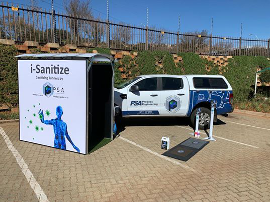
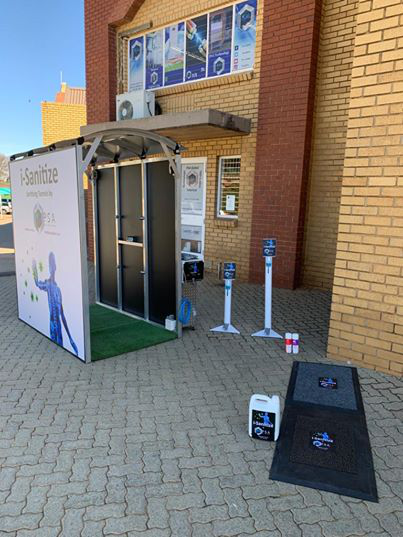
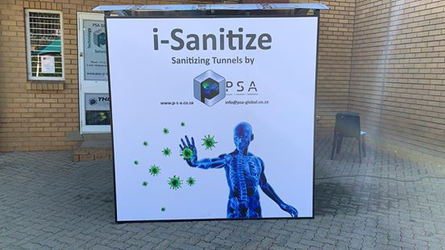

# COVID-19 Sanitisation

## Description

This repository contains the code for the i-Sanitise tunnel solution to the COVID-19, developed by [Process Solutions Automation (PSA)](https://www.p-s-a.co.za/index.html). The code is written for application on Arduino boards. We made use of the Arduino Uno board. Wiring diagrams for the project will soon be included in this repository.

## Material Requirements
The material required is as follows:

 - Arduino Uno

 - PIR sensor

 - Solenoid valve

 - 2 Pumps

 - 2 Level switches

 - 5V relay module

 - Jumper cables

There are currently two models of the i-Sanitise tunnel. The main difference being the positioning of the PIR sensor. For model-1 the PIR sensor is placed in the middle of the tunnel, by the spray valves. For model-2 the PIR sensor is placed at the tunnel entrance.

## Final Project

Car

front

Side

Solarized dark             |  Solarized Ocean
:-------------------------:|:-------------------------:
  |  

Syntax                            | Description | Test Text     
:---                              |    :----:   |          ---:
      |        | 

## Marketing

The sanitisation tunnel is built using an aluminium frame for durability and low maintenance. The roof consists of a UV-resistance sheet and the side panels are clad with solid sides or vinyl which can be branded with your personal logo.

Artificial grass flooring is used for an anti-slip surface with a drip tray to catch the excess sanitizing liquid.

The spray nozzles are industrial designed and specifically selected for the application of misting. Each nozzle is protected by our own PSA engineered nozzle holder. The nozzles come with a built-in microfilter, which can be cleaned to ensure a long lifetime of service.

The tunnel is multi-directional with stop/go traffic lights positioned at either end. The sprayers are motion activated to eliminate any wastage of sanitising liquid.

The pump is protected from running dry, via a smart controller and is protected with a circuit breaker. Our self-regulating start/stop system guarantees the correct pressure and flow at the nozzle system. The 20 L tank can sanitise +- 750 people.

The tunnel can be installed with a thermal imaging camera connected to a 18 inch monitor such that each person's body temperature walking through the tunnel is measured. A set alarm system will trigger when an individual displays fever symptoms.

The i-Sanitise IOS and Android apps allow you to access maintenance schedules, telephone support, and ordering additional sanitising liquid.
